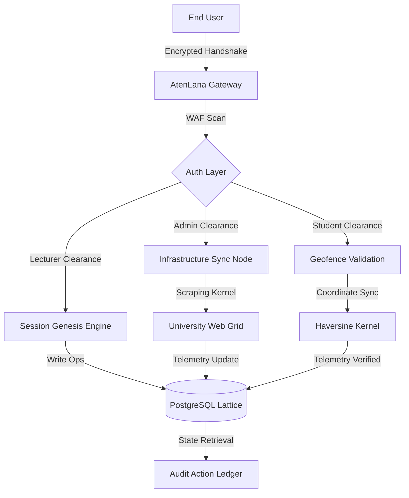

# ░▒▓ ATENLANA GRID SYSTEMS ▓▒░
<p align="center">
  
</p>

[](https://github.com/omoniregreat)
[](https://github.com/omoniregreat)
[](https://github.com/omoniregreat)

---

### [!] SYSTEM BOOT SEQUENCE
```diff
+ [0.001] Initializing AtenLana node...
+ [0.042] Loading spatial validation kernels...
+ [0.128] Authenticating Haversine proximity modules...
+ [0.450] Establishing encrypted PostgreSQL lattice connection...
+ [0.892] Web Application Firewall (WAF) online.
+ [1.104] Identity verification signatures loaded.
+ [1.250] GRID ACTIVE: UNIVERSITY 2026 INSTANCE STABLE.
```

---

### [0x01] CORE ARCHITECTURE
AtenLana is a high-fidelity **Presence Validation Ecosystem** engineered for sub-meter accuracy in institutional attendance tracking. It functions as a secure grid node that synchronizes identity telemetry with physical classroom lattices.

*   **Spatial Telemetry**: Utilizes hyper-precise GPS telemetry and Haversine-calculated proximity algorithms to define Classroom Event Horizons.
*   **Temporal Tokens**: Proprietary Token-Sync Protocol generates transient, time-locked authentication keys. Attendance is only authorized within the physical lattice of the designated learning node.
*   **Institutional Framework**: Automated synchronization with the University academic grid, dynamically fetching faculties and departments via background scraping kernels.

---

### [0x02] SECURITY LAYER & THREAT MODEL
The system implements a multi-layered defense matrix to neutralize identity spoofing and unauthorized access.

*   **Neural-Lite Matrix**: Integrated multi-layered WAF patterns to intercept and neutralize SQLi, XSS, and pattern-based intrusion attempts.
*   **Zero-Proxy Inactivity Guard**: Advanced session monitoring that triggers a page refresh after 5 minutes of inactivity or tab-switching, enforcing physical presence and preventing session hijacking.
*   **High-Fidelity VPN Detection**: A dedicated detection engine that identifies Proxies, VPNs, and hosting providers in real-time to maintain grid integrity.
*   **Identity Suspension Protocol**: Allows Superadmins to temporarily block user identities for specific durations (hours/days) to neutralize active threats.
*   **Omni-History Log**: Every administrative executive decision is recorded in an immutable ledger with temporal reversal (Undo/Redo) capabilities, ensuring complete auditability and zero data loss.

---

### [0x03] OPERATIONAL MODALITIES
| Role | Clearance | Capabilities |
| :--- | :--- | :--- |
| **SYSTEM ROOT** | Level 5 | Master Control Tower, Branding Calibration, Academic Infrastructure Sync, Global Data Purge |
| **LECTURER** | Level 3 | Session Genesis, Live Analytics Pulse, Entity Registry, Global Export Protocols (PDF/Excel) |
| **STUDENT** | Level 1 | Identity Synchronization (University ID), Temporal History Retrieval, ID Card Verification |

---

### [0x04] INFRASTRUCTURE DIAGRAM


---

### [0x05] MAINTENANCE & DEVELOPMENT
If you need to disable the service or work on it in a controlled environment:

*   **Maintenance Mode**: In the Superadmin Dashboard, toggle the **Website Status** to `OFF`. This restricts access to everyone except Superadmins.
*   **Local Development**:
    1.  Install dependencies: `pip install -r requirements.txt`.
    2.  Set up a local PostgreSQL database.
    3.  Set `DATABASE_URL` and `SECRET_KEY`.
    4.  Run `python3 api/index.py`.
*   **Disabling on Cloud**: You can suspend the service on Vercel or set the `DATABASE_URL` to an invalid string to effectively stop processing (though maintenance mode is cleaner).

### [0x06] DEPLOYMENT PROTOCOL (VERCEL)
The system is architected for seamless deployment on the Vercel serverless platform.

1.  Connect your repository to Vercel.
2.  Set the following **Environment Variables**:
    *   `DATABASE_URL`: Your PostgreSQL connection string.
    *   `SECRET_KEY`: A secure random string.
    *   `FLASK_ENV`: `production`
3.  Vercel will automatically detect `vercel.json` and deploy using the `@vercel/python` builder.

---

### [0x06] AUDIT LEDGER & INTEGRITY
The **Integrity Layer** ensures zero data loss through continuous state monitoring. Every administrative action (Creation, Modification, Deletion) creates a reversible snapshot in the `action_history` table, enabling instant recovery from hostile or erroneous operations.

---

### [0x07] VISIONARIES & ENGINEERING LEADERSHIP
AtenLana Portal is the brainchild of a dedicated taskforce committed to academic modernization.

**Omonire O. Great — CEO & Founder | Visionary Architect**
*   **Engineering Focus**: Python, Flask, Cybersecurity, Ethical Hacking, Linux Operations.
*   **Certifications**: CEH, CompTIA CYSA+ & Junior CYSA+, CNSS, CYTM, CEPS, CPyE.
*   **Mission**: To modernize academic workflows globally through token-based verification and automated spatial validation.

---

### [0x08] SYSTEM FOOTER
**NODE**: ATENLANA-UNIVERSITY-2026
**STATUS**: ACTIVE // GRID STABLE
**LICENSE**: PROPRIETARY INSTITUTIONAL LICENSE

```text
█║▌║█║║█║▌║█║║█║▌║█║║█║▌║█║║█║▌║█
    ATENLANA PORTAL // 2026 UNIT
      PRECISION IDENTITY OPS
```
